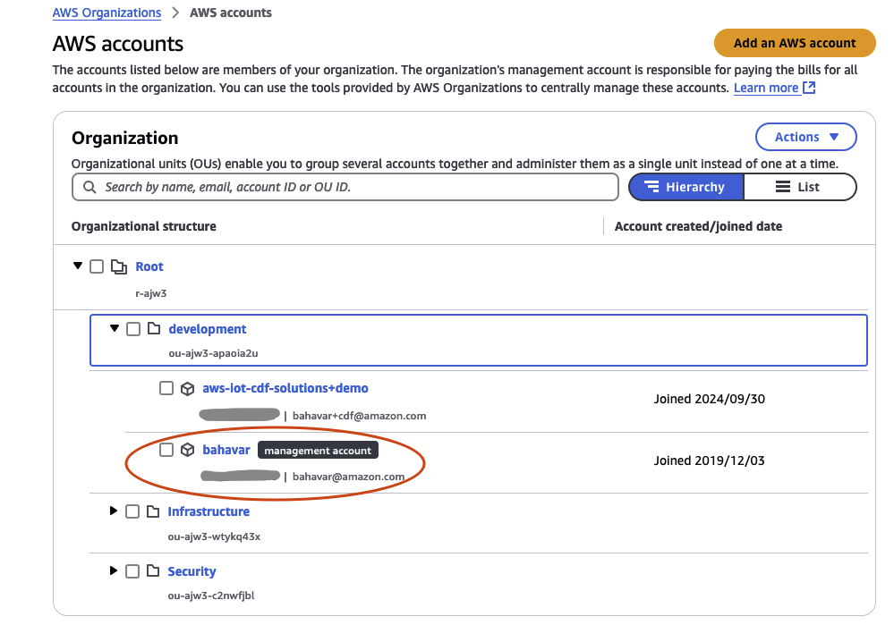

# Data Management CLI

## Overview

`data-management cli` is a CLI that offers management of Data Management installations.
Currently the CLI only supports the deployment of the entire Data Management into a single AWS Account

**_Note:_** The Data Management deployed by the CLI is meant to be used for evaluation purposes only and is not meant to be used in a production setting.

## Supported Operating systems

The CLI supports the following operations systems

-   OSX
-   Windows
-   Linux

**_Note:_** Due to conflict with library dependencies Amazon Linux OS is currently not supported

## Prerequisites

1. The AWS Account being deployed to must be a management account in an Organization underneath an Organization unit (ou), like this:



2. The AWS Region being deployed to must have AWS IAM Identity Center enabled on it
3. CLI user must have Admin level permissions
4. CLI user must be a Lake Formation administrator
5. If using an existing VPC for the installation, you VPC needs to comply with the following
    1. Have Public, private and isolated subnets
    2. VPC endpoints in the VPC and private subnets where redshift is deployed
        1. S3 gateway
        2. Glue
        3. Databrew
6. These deployment instructions are intended for use on MacOS. Deployment using a different operating system may require additional steps
7. Install [git](https://git-scm.com/book/en/v2/Getting-Started-Installing-Git)

### Windows Prerequisites

In addition to the general prerequisites above windows systems have the following additional prerequisites:

1. Install [nvm-windows](https://github.com/coreybutler/nvm-windows)
2. Install [Docker] (https://docs.docker.com/desktop/install/windows-install/)
3. Install [openssl] (https://github.com/openssl/openssl/blob/openssl-3.4/NOTES-WINDOWS.md)

## Setup

1. Install [bun](https://bun.sh/docs/installation).

2. To install dependencies:

```bash
guidance-for-data-management-on-aws/typescript/packages/apps/cli> bun install
```

3. To make available globally as a CLI:

```bash
guidance-for-data-management-on-aws/typescript/packages/apps/cli> bun link
guidance-for-data-management-on-aws/typescript/packages/apps/cli> bun link @dm/cli
```

4. To run:

```bash
> cd ./guidance-for-data-management-on-aws
> data-management install
```

## Usage

```bash
> data-management --help
 ____        _          __  __                                                   _   
 |  _ \  __ _| |_ __ _  |  \/  | __ _ _ __   __ _  __ _  ___ _ __ ___   ___ _ __ | |_ 
 | | | |/ _` | __/ _` | | |\/| |/ _` | '_ \ / _` |/ _` |/ _ \ '_ ` _ \ / _ \ '_ \| __|
 | |_| | (_| | || (_| | | |  | | (_| | | | | (_| | (_| |  __/ | | | | |  __/ | | | |_ 
 |____/ \__,_|\__\__,_| |_|  |_|\__,_|_| |_|\__,_|\__, |\___|_| |_| |_|\___|_| |_|\__|
                                                  |___/                               
data-management <command>

Commands:
  data-management install  Installs Data Management for evaluation within a single AWS Account.

Options:
  --version  Show version number                                                                                                                                                                                                                                                                                                                                                         [boolean]
  --help     Show help
```

### `install` command

For mac & linux:

```bash
> export AWS_REGION=<AWS Region where IAM Identity center is enabled on>
> data-management install
```

For Windows:

```bash
> set AWS_REGION=<AWS Region where IAM Identity center is enabled on>
> data-management install
```

The `install` command walks the user through an opinionated single-account installation of Data Management. Note that this single-account mode is recommended for evaluation only. A best practice for a production deployment would be to deploy the different components of the Data Management into different accounts.

#### IAM Identity Center application

There is manual step that need to be performed for the initial deployment.
Data Management requires an IAM Identity center to be setup for SAML authentication.

Once the setup reaches the following question pause the installation and follow instructions bellow to setup the application.

`Have you setup your IAM Identity Center application? (Y/n)`

**_Note:_** this step only needs to be performed once for the initial deployment

1.  Open the IAM Identity Center console and then, from the navigation pane, choose Applications.
2.  Choose Add application, I have an application I want to set up, and Add custom SAML 2.0 application, and then choose Next.
3.  On the Configure application page, enter a Display name and a Description.
4.  Copy the URL of the IAM Identity Center SAML metadata file. You use these resources in later steps to create an IdP in a user pool.
5.  Under Application metadata, choose Manually type your metadata values. Then provide the following values.
6.  Important: Make sure to replace the domain, region, and userPoolId values with information you gather after the CDK deployment. - Application Assertion Consumer Service (ACS) URL: `<userPoolDomain>/saml2/idpresponse` - Application SAML audience: `urn:amazon:cognito:sp:<userPoolId>`
7.  Choose Submit. Then, go to the Details page for the application that you added.
8.  Select the **Actions** dropdown list and choose **Edit attribute mappings**. Then, provide the following attributes.

-   User attribute in the application: `Subject`
-   Note: Subject is prefilled.
-   Maps to this string value or user attribute in IAM Identity Center: `${user:subject}`
-   Format: `Persistent`

           - User attribute in the application: `email`
              - Maps to this string value or user attribute in IAM Identity Center: `${user:email}`
              - Format: `Basic`

Once the application is setup continue with the CLI installation by answering `Y` to:
`Have you setup your IAM Identity Center application?`

Follow the command prompts to finish the Data Management installation.

# Deployment Validation

1. Check that the following CloudFormation stacks have been successfully created in your account:
    1. `dm-spoke-shared`
    2. `dm-spoke-dataAsset`
    3. `dm-hub-shared`
    4. `dm-hub-CognitoCustomStack`
    5. `dm-hub-SsoCustomStack`
    6. `dm-hub-datalineage`
    7. `dm-hub-dataAsset`
    8. `dm-demo-management`
    9. `dm-demo-hub`
    10. `dm-demo-spoke`

## Running the Guidance

### Creating Assets

The following outlines steps to be done to create an asset using the Data Asset API. Below this are examples using a simple sample dataset.

1. Generate a token
    1. Go to Amazon Cognito in the Hub account
    2. Select the `dm` user pool
    3. Click **App Integration**
    4. Scroll the the bottom of the page and select `dm-sso-client` from the App client list
    5. Scroll to the Hosted UI section and click View Hosted UI
    6. Log in with your configured IAM Identity Center User
    7. You should be redirected to localhost in your browser
    8. Copy the url from your browser into a text editor
    9. It should take the form of `localhost:3000/#access_token=<ACCESS_TOKEN>&id_token=<ID_TOKEN>&token_type=Bearer&expires_in=3600`
    10. Copy the ID token, which should be valid for 1 hour. You can click through the hosted UI again to generate a new token.
2. Open an API client of your choice
    1. Go to AWS Systems Manager Parameter Store and open the `/dm/dataAsset/apiUrl` parameter. This is the API URL.
    2. Configure the client as follows:
        1. Method `POST`
        2. URL: `<API_URL>dataAssetTasks`
        3. Auth: Bearer token generated above
        4. Headers:
            1. `accept-version`: `1.0.0`
            2. `accept`: `application/json`
        5. Body:
            ```
            {
               "catalog": {
            	  "domainId": "<DATAZONE_DOMAIN_ID>",
            	  "domainName": "<DATAZONE_DOMAIN_NAME>",
            	  "environmentId": "<DATAZONE_ENVIRONMENT_ID>",
            	  "projectId": "<DATAZONE_PROJECT_ID>",
            	  "region": "<REGION>",
            	  "assetName": "my-asset",
            	  "accountId": "<SPOKE_ACCOUNT_ID>",
            	  "autoPublish": true,
            	  "revision": 1
               },
               "workflow": <SEE_BELOW>
            }
            ```
        6. Run the request
        7. Check that the Step Functions have completed successfully.
            1. Go to the AWS Console in the hub account and look at the `dm-data-asset` State Machine in AWS Step Functions. You should see a successful an execution running.
            2. Go to the AWS Console in the spoke account and look at the `dm-spoke-data-asset` State Machine in AWS Step Functions. You should see an execution running.
            3. Once the executions complete, you should be able to[find the new assets in the DataZone data catalog](https://docs.aws.amazon.com/datazone/latest/userguide/search-for-data.html).

#### Sample Dataset

A simple sample dataset file can be found [in docs/sample_data/sample_products.csv](./docs/sample_data/sample_products.csv). Below are a few sample rows:

| sku     | units | weight | cost   |
| ------- | ----- | ------ | ------ |
| Alpha   | 104   | 8      | 846.00 |
| Bravo   | 102   | 5      | 961.00 |
| Charlie | 155   | 4      | 472.00 |

These rows represent a table of product names, the number of units in inventory, their weight, and their cost. Below we will add this data as assets in the Data Management using the Data Asset API. There is an example of creating a Glue table asset backed by S3 or a Redshift table. Both of these assets will be managed assets in DataZone meaning other users of DataZone can subscribe to and consume these when published.

#### Glue Tables

1. Load the CSV file into the `dm-spoke-<SPOKE_ACCOUNT_ID>-<REGION>` S3 bucket
2. Make an API request replacing the request body `workflow` with:
    ```
    {
    	"name": "sample-products-workflow",
    	"roleArn": "<SERVICE_ROLE_ARN>",
    	"dataset": {
    		"name": "sample-products-dataset",
    		"format": "csv",
    		"connection": {
    			"dataLake": {
    				"s3": {
    				"path": "s3://<S3 PATH>/",
    				"region": "<REGION>"
    				}
    			}
    		}
    	},
    	"transforms": {
    		"recipe": {
    		"steps": [
    			{
    				"Action": {
    					"Operation": "LOWER_CASE",
    					"Parameters": {
    						"sourceColumn": "sku"
    					}
    				}
    			}
    		]
    		}
    	},
    	"dataQuality": {
    		"ruleset": "Rules = [ (ColumnValues \"units\" >= 0) ]"
    	}
    }
    ```

**_Note:_** the S3 path passed in the connection.dataLake.s3.path\_ parameter is the S3 path to the asset. The resulting workflow will create a glue crawler at the path (prefix) level which will crawl all files under that prefix. This allows for creating a data asset which is composed of multiple CSV files or has hive partitioning (`year=2024/month=01/...`) under the prefix.

This workflow includes a transform and a user-defined data quality check. The transform takes the form of a Glue DataBrew recipe. In this case the transform converts the product names in the `sku` column to lowercase. The data quality check will define and run a Glue Data Quality check and include the results of the check in the metadata of the asset created in Data Zone. In this case the data quality check will ensure the `units` column contains non-negative values.

#### Redshift Tables

1. Load a table into your Redshift data warehouse.
2. Make an API request with the following request body `workflow`:
    ```
    	{
    		"name": "sample-products-redshift-workflow",
    		"roleArn": "<SERVICE_ROLE_ARN>",
    		"dataset": {
    			"name": "sample-products-redshift-dataset",
    			"format": "csv",
    			"connection": {
    				"redshift": {
    					"secretArn": "REDSHIFT_ADMIN_SECRET_ARN",
    					"jdbcConnectionUrl": "REDSHIFT_CONNECTION_URL",
    					"subnetId": "REDSHIFT_SUBNET_ID",
    					"securityGroupIdList": ["REDSHIFT_SG_ID"],
    					"availabilityZone": "REDSHIFT_AZ",
    					"path": "<DB_NAME>/<SCHEMA_NAME>/sample_product_table",
    					"databaseTableName": "<SCHEMA_NAME>.sample_product_table",
    					"workgroupName": "REDSHIFT_WORKGROUP_NAME"
    				}
    			}
    		}
    	}
    ```
    This workflow does not include a transform or user-defined data quality check as in the Glue Table example above. These can be added to the request if desired.

### Viewing Assets

After the data asset workflow completes a new data asset will be published to the fabric.

#### Catalog

The Data Management catalog can be searched within Amazon DataZone. See the [documentation](https://docs.aws.amazon.com/datazone/latest/userguide/search-for-data.html) for more information.

#### Lineage

You can view the lineage information from the Marquez portal or the Marquez API. The location of these endpoints can be found in the following SSM parameters `/dm/dataLineage/openLineageApiUrl` and `/dm/dataLineage/openLineageWebUrl`.

## Next Steps

1. Customers can bring their own tools for profiling/quality, etc. to the Data Management.
2. Customers can attach into \*DM message bus (EventBridge) to trigger any other processes that need to be added.
3. Customers can author their own data products. See the [Guidance for Sustainability Data Management on AWS](https://github.com/aws-solutions-library-samples/guidance-for-sustainability-data-management-on-aws) for an example data product implementation. If you would like to develop your own data product, see the guide on [Authoring Your Own Data Product](./docs/tutorials/dataProduct/README.md).

## Cleanup

To Cleanup all resources created for Data Management, perform the following steps.

### `delete` command

To Delete Data Management from your account run the following command and go through the prompts.
This command will delete most resources that have been deployed.

To Delete:

```bash
> cd <cloned repo folder with branch to be summarized>
> data-management delete
```

### Manual cleanup

Several of the resources deployed by the Data Management need to be removed manually, perform the following steps to remove them from your account:

1. AWS Lake Formation cleanup
    1. Navigate to AWS Lake Formation > Permissions > Data lake permission : And Grant `Drop` permissions to your user on the `datafabricdatalakeenvironment_pub_db` and `datafabricdatalakeenvironment_sub_db` databases
    2. Navigate to AWS Lake Formation > Data Catalog > Databases : And delete `datafabricdatalakeenvironment_pub_db` and `datafabricdatalakeenvironment_sub_db`
    3. Navigate to AWS Lake Formation > Administration > Administrative roles and tasks: And remove the `AmazonDataZoneGlueAccess-<region>-<DataZone Domain Id>`, `dataManagementDomainExecutionRole` , `dataManagementDomainProvisioningRole`

## Notices

_Customers are responsible for making their own independent assessment of the information in this Guidance. This Guidance: (a) is for informational purposes only, (b) represents AWS current product offerings and practices, which are subject to change without notice, and (c) does not create any commitments or assurances from AWS and its affiliates, suppliers or licensors. AWS products or services are provided “as is” without warranties, representations, or conditions of any kind, whether express or implied. AWS responsibilities and liabilities to its customers are controlled by AWS agreements, and this Guidance is not part of, nor does it modify, any agreement between AWS and its customers._
